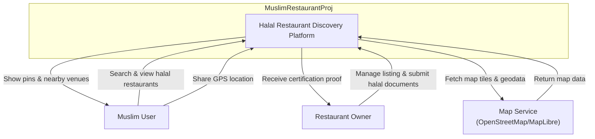
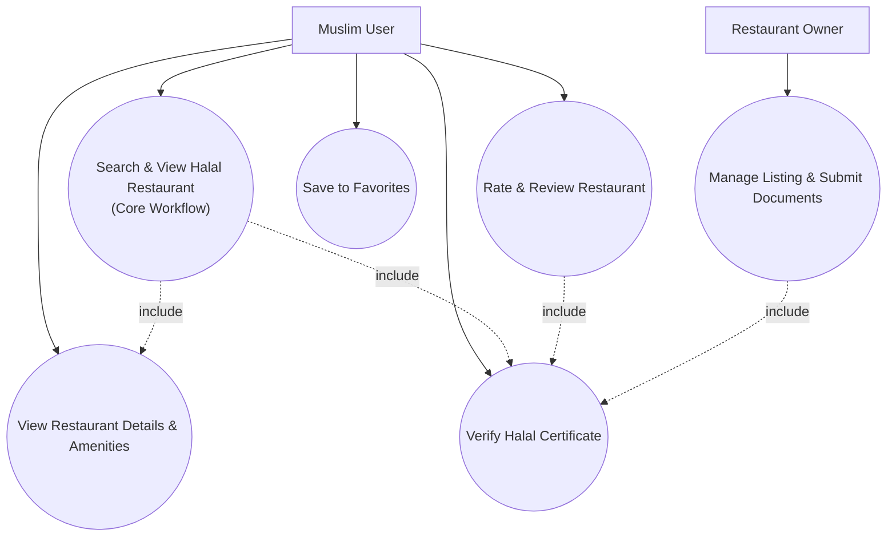
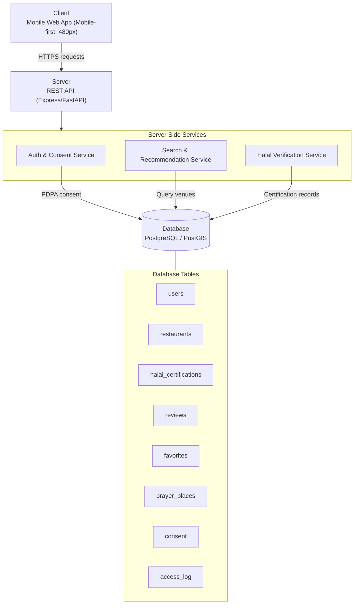
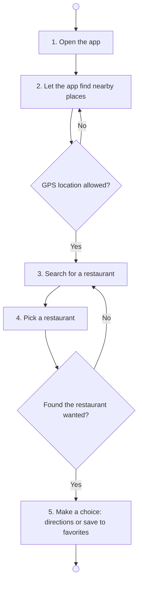

# Diagrams D1–D4 — MuslimRestaurantProj (Halal Chiang Rai)

## D1 — System Context (C4)

---

## D2 — Use Case Diagram

---

## D3 — High-level Architecture

---

## D4 — Activity Diagram (Core Workflow, 5 Steps)

